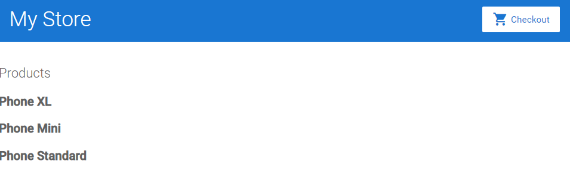

# Angular Excercise 1

Creating an Angular application from scratch.

This guide is based on the [Getting started with Angular] (https://angular.io/start), adding step-by-step instructions to create the application using the CLI new command. 

https://angular.io/start
 
## Development

### Install framework

Ensure that Angular is installed. It is based on the on the [Setting up the local environment and workspace](https://angular.io/guide/setup-local) guide.
 
From the command line install the Angular CLI application. This tool will help to generate a starter application;
 
`npm install -g @angular/cli`
 
### Create a new application

From the base directory from where you store your projects/source code, run the command below. This will create a directory with the name of the project;
 
`ng new angular-exercise-1`

Select the following option when asked to do so;
* Add Angular routing - Yes
* SCSS

Now run the application by using the serve command. The --open option will open the app in the default browser.

`ng serve --open`

A web browser page should open with a page similar to the one below.


### Development
 
Use VisualCode and use the *File -> Open Folder* menu command, pointing to the newly created directory. 
 
#### Remove sample code

Remove the sample code which is located in `src/app/app.component.html` and replace it with this code;

```
<div class="container">
  <router-outlet></router-outlet>
</div>
```

Add the container `div`
#### Add style sheets and visual design system

Add Material Design library, which will give us that distinctive look. Note that JHipster uses Bootstrap by default, not this library. This can be done from the Terminal window in VisualCode. Use the *Terminal->New Teminal (Ctrl+Shift+`)* option.
 
`ng add @angular/material`

Confirm the following prompts;
* Confirmation to proceed - Yes
* Pre-built theme - Pick any one of the themes
* Typography styles - No
* Browser animations - No

Modify the `src/styles.scss` file to match the one in this repository.

#### Add a top navigation bar

We will now create a new component which will contain the layout and code for the top navigation bar. Run the following command using the Angular CLI to create the new component;

`ng generate component top-bar`
 
Add this code to the `src/app/top-bar/top-bar.component.html` page;

```
<a [routerLink]="['/']">
  <h1>My Store</h1>
</a>

<a class="button fancy-button"><i class="material-icons">shopping_cart</i>Checkout</a>

```

We are making no changes to the TypeScript source code for this library. Note that the new component has an `@Component` annotation with a `selector: 'app-top-bar'` value. This will inform the naming of the tag in the next step.

Now edit the `src/app/app.component.html` file and add a new tag matching the selector name. The file should now look like this;

```
<app-top-bar></app-top-bar>

<div class="container">
  <router-outlet></router-outlet>
</div>
```

The application web page should now update to look like this;


#### Product list component

We will now create a new component which will display a list of product. We will implement this as a page located at the root of the application URL, which will also be the default page being shown.

Run the following command using the Angular CLI to create the new component;

`ng generate component product-list`

A new directory would have been created in `src/app/product-list`.

Lets add some initial HTML code to the component's HTML file in `src/app/product-list/product-list.component.html`;

```
<h2>Products</h2>
```

Replace any code which might already be there.

Make the new component, and therefore the new HTML page which was just edited, the default page of the application by adding the new ProductListComponent as default route for the application. In `src/app/app-routing.module.ts` edit the `const routes` as follows;

```
const routes: Routes = [{ path: '', component: ProductListComponent }];
```

It will be necessary to add the import statement for the `ProductListComponent` as well. This can be done using the IDE's auto-complete function (Ctrl-Space) when typed just after the component name, or hovering over the text being indicated as in error and selecting *QuickFix* followed by the import suggestion. Also, you can just add the following text too if that does not work;

```
import { ProductListComponent } from './product-list/product-list.component';
```

The "Product" text should now be displayed on the main page.


Lets create a data source so that we can display a few products. We will use a constant array called `products` which we will add to a file called `src/app/products.ts`. Paste the contents below into that file. 

```
export interface Product {
  id: number;
  name: string;
  price: number;
  description: string;
}

export const products: Product[] = [
  {
    id: 1,
    name: 'Phone XL',
    price: 799,
    description: 'A large phone with one of the best screens'
  },
  {
    id: 2,
    name: 'Phone Mini',
    price: 699,
    description: 'A great phone with one of the best cameras'
  },
  {
    id: 3,
    name: 'Phone Standard',
    price: 299,
    description: ''
  }
];

```

In a real life application this data will typically be served by a back-end system using an API.

Now create a variable called `products` inside the `src/app/product-list/product-list.component.ts` file and set it in the constructor;

```
  products;

  constructor() {
    this.products = products;
  }
```

Add an import statement to refer to the `const products` in the newly created file. Also add an import statement for the `Product` interface.

```
import { Product, products } from '../products';
```

Next, to demonstrate the `ngFor` functionality of Angular, lets add some code the the HTML page `src/app/product-list/product-list.component.html` to display some static code for each record in this new array we have created;

```
<div *ngFor="let product of products">
  A product!
</div>
```

The static text we just added just should now be displayed under the Products heading 3 times;


This is not very useful, but it demonstrates how the for loop works. Lets add some more relevant data. Change the HTML page `src/app/product-list/product-list.component.html` to display the name of the product, replacing the previous for loop which was added;

```
<div *ngFor="let product of products">
  <h3>
    {{ product.name }}
  </h3>
</div>
```

Now the product name will be displayed, which is more functional;



We can also change the heading to a link, so that we can add a product detail page at a later stage. We can do this by again replacing the previous loop with the following;

```
<div *ngFor="let product of products">
  <h3>
    <a [title]="product.name + ' details'">
      {{ product.name }}
    </a>
  </h3>
</div>
```

This new code will now also display a tooltip if you hover over the link. Note that the links does not yet navigate to a page.


We can add more details to each product, such as a description. Add the following just **before** the last `</div>` in the `src/app/product-list/product-list.component.html` HTML page;

```
  <p *ngIf="product.description">
    Description: {{ product.description }}
  </p>
```


Lastly, lets add a button to the product list. We will call a method in the TypeScript file first to display a popup window when executed. Add the following to the bottom of the `src/app/product-list/product-list.component.ts` file;

```
  share() {
    window.alert('The product has been shared!');
  }
```

Now add the following just **before** the last `</div>` in the `src/app/product-list/product-list.component.html` HTML page;

```
  <button (click)="share()">
    Share
  </button>
```


Clicking the button will open a popup diaglog.

## Development server

Run `ng serve` for a dev server. Navigate to `http://localhost:4200/`. The app will automatically reload if you change any of the source files.

## Code scaffolding

Run `ng generate component component-name` to generate a new component. You can also use `ng generate directive|pipe|service|class|guard|interface|enum|module`.

## Build

Run `ng build` to build the project. The build artifacts will be stored in the `dist/` directory.

## Running unit tests

Run `ng test` to execute the unit tests via [Karma](https://karma-runner.github.io).

## Running end-to-end tests

Run `ng e2e` to execute the end-to-end tests via a platform of your choice. To use this command, you need to first add a package that implements end-to-end testing capabilities.

## Further help

This application was generated using [Angular CLI](https://github.com/angular/angular-cli) version 12.0.5.

To get more help on the Angular CLI use `ng help` or go check out the [Angular CLI Overview and Command Reference](https://angular.io/cli) page.
